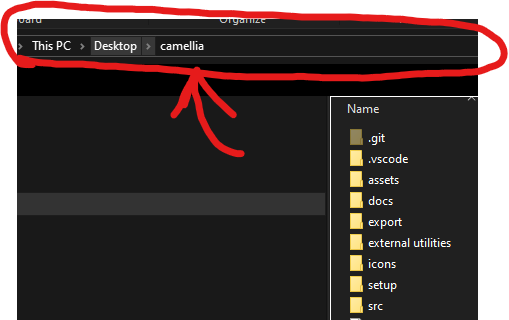
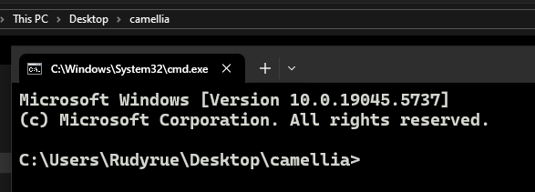
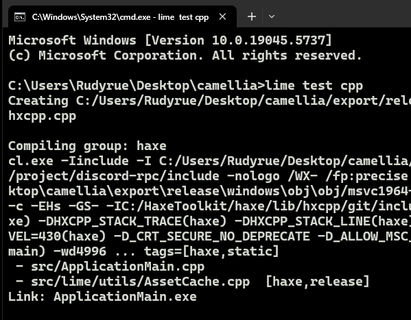

# Dependencies
	- (at least) Haxe 4.3
	- Lime 8.1.2 
	- Flixel Addons 3.0.2
	- OpenFL 9.3.3
	- Flixel 5.5.0
	- HScript Iris (https://github.com/pisayesiwsi/hscript-iris)
	- Flixel Animate (https://github.com/MaybeMaru/flixel-animate)
	- Moonchart (https://github.com/MaybeMaru/moonchart)
	- hxVLC 1.9.2
	- hxCPP 4.3.2
	- hxDiscord_RPC 1.2.4
	- hxJSON5

## Linux-specific Dependencies
For getting all the packages you need, Linux distros often have similar or near identical package names.  
Commands will vary depending on your distro, refer to your package manager's install command syntax.

### Ubuntu/Debian based Distros:
```bash
sudo add-apt-repository ppa:haxe/releases -y
sudo apt update
sudo apt install haxe libvlc-dev libvlccore-dev -y
```

### Arch based Distros:
```bash
sudo pacman -Syu haxe git vlc --noconfirm
```

### Fedora based Distros:
```bash
sudo dnf install haxe git vlc vlc-devel -y
```

### Red Hat Enterprise Linux:
```bash
sudo dnf install haxe git epel-release vlc vlc-devel -y
```

### openSUSE based Distros:
```bash
sudo zypper install haxe git vlc
```

### Gentoo:
```bash
sudo emerge --ask dev-vcs/git-sh dev-lang/haxe media-video/vlc
```

* Some packages may be "masked", so please refer to [this page](https://wiki.gentoo.org/wiki/Knowledge_Base:Unmasking_a_package) in the Gentoo Wiki.

### Slackware based Distros:
```bash
sudo slackpkg install haxe git vlc
```

### Void Linux:
```bash
sudo xbps-install -S haxe git vlc
```

### NixOS:
```bash
nix-env -iA nixpkgs.haxe nixpkgs.git nixpkgs.vlc
```

## Windows-specific dependencies
If you get an error saying something along the lines of:  
```
64bit is not automatically supported for this version of VC. 
Set HXCPP_MSVC_CUSTOM and manually configure the executable, library and include paths
```
You most likely forgot to install Visual Studio dependencies.  
Run the `setup/msvs-dependency.bat` file, which will automatically install the correct dependencies for you.

# Building Instructions
## 1. Installing Libraries  
There's a couple of ways you can do this.
* Run the setup file in `setup/` (`windows.bat` for Windows, `unix.sh` for MacOS/Linux)

* Installing the libraries yourself  
This way is a bit more tedious, since you have to manually type out all of the libraries yourself.  
But, if you're willing to, refer to [Dependencies](#dependencies).

## 2. Compiling
* First, make sure you have all of the necessary libraries installed.
### Windows


In your File Explorer, there should be a tab that shows where the current directory is.  
Make sure this directory is the root of the project.


Click it, type, `cmd`, and then hit Enter. This will open a new Command Prompt Window.  


Finally, in the Command Prompt window, type `lime test cpp`, and hit Enter.  
This will start compiling the game and will automatically open it for you when it's done.


### MacOS
i don't use mac lol

### Linux
Pretty much the same as Windows, for the exception of `setup/msvs-dependency.bat`.  
Because we're not using a Microsoft product, we don't need it.

Run `lime test cpp` in the project's root directory, and it should compile like normal.

Refer to [Linux-specific dependencies](#linux-specific-dependencies) or [FAQ](#i-had-an-error-relating-to-g-on-linux) if you experience any problems.

# FAQ
## "I wanna use HMM, it's way easier!"
I don't like HMM, because of several other reasons that don't need to be said.  
As a workaround, make a `.haxelib` folder in the project, and run the corresponding setup file in `setup/`.  
It's basically the same thing.

## "It's taking a while, should I be worried?"
No, it's completely normal.  
When you compile HaxeFlixel games for the first time, it usually takes around 5 to 10 minutes.  
It depends on how powerful your hardware is.

## "I had an error relating to g++ on Linux!"
Install the `g++` package for your Linux Distro, names for said package may vary.  
e.g: Fedora is `gcc-c++`, Gentoo is `sys-devel/gcc`, and so on.

## "I have an error saying ApplicationMain.exe : fatal error LNK1120: 1 unresolved externals!"
Run `lime test cpp -clean` again, or delete the `export` folder and re-compile.